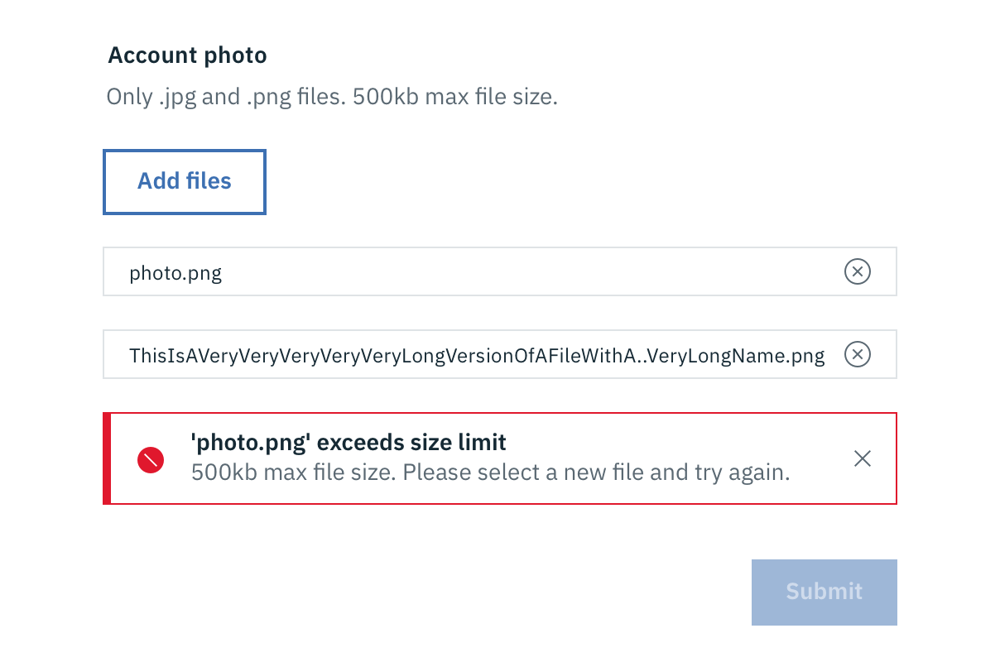
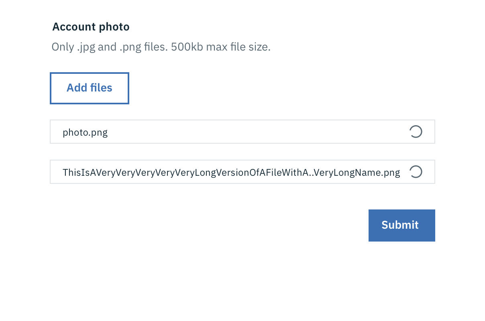

## General

- A File Uploader is commonly found in forms, but they can also live as stand alone elements.
- **Add files** is the default text that appears with the File Uploader.
- A File Uploader should always be accompanied by **Submit** or **Upload**, which is to be styled as a [Secondary Button](/components/button).
- Use an ellipsis (...) if the filename extends beyond the width of its parent element.

## Basic interaction

1. The user may select 1 or more files to upload at a time. By default, any file type is accepted, but you can add parameters to validate a specific file type.
2. The action of clicking **Add files** will trigger a browser-specific upload window.
3. Once the user chooses files to upload, the browser-specific upload window closes and the files will appear below the **Add files** button.
4. User clicks **Submit** or **Upload** to submit their data.
5. Any errors that may occur with the file should appear as an inline error
   [Notification](/components/notification).

_Errors in File uploader_

## Upload state

Developers using File Uploader will be able to use JavaScript to inject a Loading component when selected files are actually being uploaded.

## Removing files

Developers will use JavaScript to inject a “close” button on each file that is selected to be uploaded. It's up to the developer to code the logic for removing these files individually. However, keep in mind that this kind of editing isn't supported natively in the browser.
