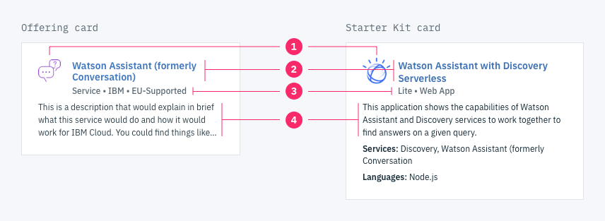
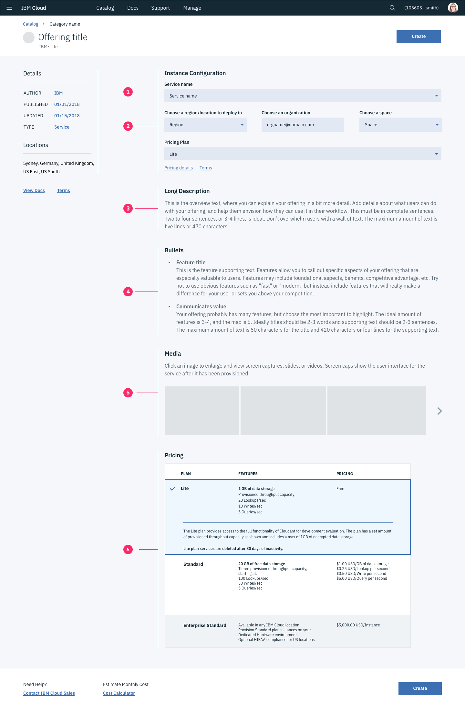
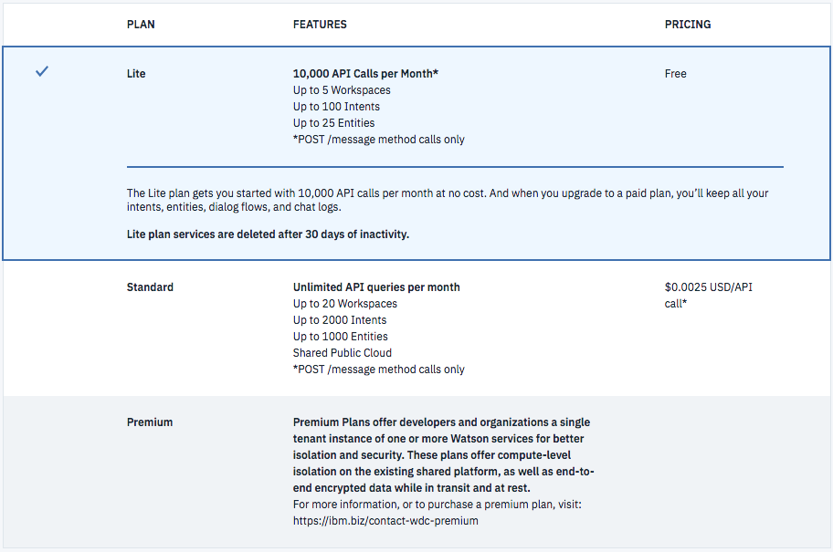
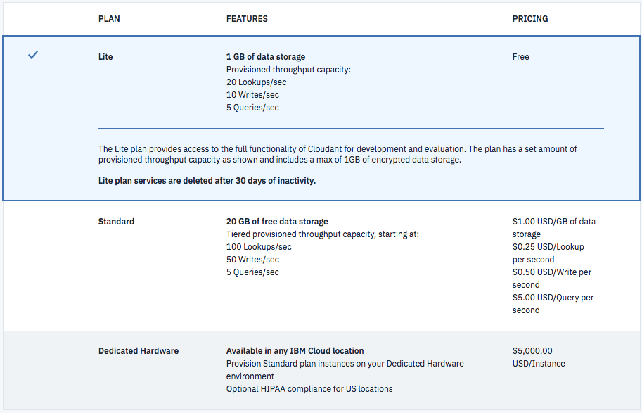

<page-intro>The IBM Cloud Catalog ("Catalog") is the place developers, data scientists, IT admins, and other IBM Cloud users go to discover, evaluate, and create offerings. The following guidelines will help you create or update an offering listing to ensure that it meets IBM Cloud quality standards and meets your users' needs.</page-intro>

## How to use this document

Follow the checklist and instructions below to update your listing and make sure it is compliant.

### How to make changes to your listing

1. Make edits in the [Global Catalog staging environment](https://resource-catalog.stage1.ng.bluemix.net/search).
2. Preview changes in the [Staging UI](https://dev-console.stage1.bluemix.net/catalog/).
3. Notify Matt Heitzer and Mark Meredith of your changes for review.
4. If your content needs translation, contact Shun Xian Wu and Dianne Liu for more guidance.
5. When changes have been approved, update your listing in the [Global Catalog production environment](https://resource-catalog.ng.bluemix.net/search).
6. Monitor your analytics on Amplitude to confirm your changes had a positive effect.

### Catalog Listing Checklist

See the below sections for more details on each item.

- Length of all text is correct. Check the following:
  _ [Offering title](#title)
  _ [Short description](#short-description)
  _ [Long description](#long-description)
  _ [Bullets](#bullets) (number of bullets, title and supporting text length)
- [Icon](#icon) follows service icon guidelines
- [Media](#media) is up-to-date and brings value & clarity to users (optional)
- [Pricing](#pricing) is concise and not written in complete sentences
- Offering is [tagged](#search-tags) with relevant search terms

## Contents

1. **[Editorial Guidance](#Editorial-Guidance)**

2. **[Catalog Structure](#catalog-structure)**

3. **[Featured Offerings](#Featured-Offerings)**

4. **[Summary Card](#summary-card)**

5. **[Offering Detail Page](#offering-detail-page)**

6. **[Search & Categorization](#Search-&-Categorization)**

7. **[Usage & Analytics](#usage-&-analytics)**

## Editorial Guidance

### Voice & Tone

Reference the [Voice & Tone guidelines](http://design-system.stage1.mybluemix.net/guidelines/content/general) when writing content for the Catalog or anywhere in the IBM Cloud.

### Catalog Principles

The Catalog is the place users go to discover, evaluate, and create. User testing studies and data have shown that users are more likely to be interested in or purchase an offering if the following best practices are met:

- **Know your user:** None of the following best practices can be met if you do not know your user. Knowing where they come from, their pain points, and their needs allows you to decide how to best help them find and learn about your offering. It is the service provider's responsibility to know your user when developing a product.
- **The right amount of information:** Too much information or a "wall of text" makes it less likely users will read the information at all. Less information allows users to skim and evaluate more quickly.
- **Relevant information:** Only include information that helps users understand what your offering does and how they can use it. Ask yourself "Will this content help my user make a decision?"
- **Reduce cognitive load:** Asking your users to read information and make choices contributes to their cognitive load; too much load prevents users from making a decision. Whenever possible, simplify content and processes, for example: pre-fill configuration fields or inputs.

### Catalog governance

To ensure that offerings meet the criteria outlined in these guidelines, the catalog team will be responsible for reviewing any proposed changes to an offering's catalog entry.

For more details, see the [Catalog Governance](https://ibm.ent.box.com/notes/290560698464) document. For any questions, and to get your updates approved, contact Matt Heitzer and Mark Meredith.

## Catalog Structure

The Catalog consists of several pages and content types:

- A main page with an "All Categories" view and individual categories' views. The main page displays summary cards for each offering listing. This page also has search and filter functionality.

- An offering detail page, which contains metadata, text and media that describe your offering and configuration fields or page(s), depending on the complexity of your offering's configuration.

## Featured Offerings

Contact Matt Heitzer or Mark Meredith to determine if your offering may be featured. Featured offerings need to be high performing and must meet all of the guidelines outlined in this document.

### Illustration

The featured offering card displays an illustration instead of the service icon.

**Do**

- Use an illustration that measures 165x135 px
- Ensure your illustration represents your offering
- Use an existing illustration, provided it fits into the size requirements
- Follow your offering's brand guidelines
- Provide an illustration with a transparent background

**Don't**

- Use an icon
- Stretch artwork to fit the size requirements
- Provide an illustration with a solid colored background

**Examples**

## Summary Card

The summary card appears on the main Catalog page and contains a title, short description, icon, and metadata labels/tags. The summary card gives your users a quick overview of your offering and allows them to evaluate whether it meets their needs.

### 1. Icon

Review the [service icon guidelines](http://design-system.stage1.mybluemix.net/your-product-on-ibm-cloud/service-providers/general#) for information on the design, production, approval, and submission of service icons.

### 2. Title

**Do**

- Use a title that is logical and descriptive of your offering
- Use title case (unless it goes against overriding brand guidelines, like "box")
- Write 2-3 words, 45 characters, or two lines maximum

**Don't**

- Use the words "IBM" or "IBM Cloud," as it is assumed by using the IBM tag
- Include unnecessary words or details — this information belongs in the short description or on the offering detail page
- Use punctuation like dashes, colons or slashes
- Write more than 45 characters or two lines

**Examples**

- Bare Metal Server (_17 characters_)
- Internet of Things Platform (_27 characters_)
- Watson Natural Language Understanding Basic (_43 characters, approaching the max_)

### 3. Tags

Some tags are visible on the summary cards. See Filtering in the Search & Categorization section below for guidelines pertaining to tags.

Visible tags:

**Author:** IBM, Third Party, Community

**Pricing plan:** Lite

**Compliance:** EU Supported

**Release:** Beta, Experimental

### 4. Short description

**Do**

- Focus on what the user will be able to do with your offering
- Start with a verb
- Write one concise sentence; about 10 words is recommended
- Write 120 characters (about 17-20 words) maximum

**Don't**

- Write more than 120 characters, as the short description doesn't appear anywhere else in the UI and will never be read
- Repeat the name of the offering, as it will always be shown in combination with the title
- Begin the sentence with "the service is...", as it is implied

**Examples**

- "Deploy secure, highly available apps in a native Kubernetes experience." (_70 characters_)
- "Use deep learning algorithms to analyze images that can give you insights into your visual content." (_99 characters_)
- "Analyze text to extract meta-data from content such as concepts, entities, emotion, relations, sentiment, and more." (_114 characters, approaching the max_)

## Offering Detail Page

Once users select an offering, they are taken to the Offering Detail page. This page is where users configure your offering (unless configuration is too complex; see below). It also provides space for more details, as well as metadata, media, and pricing information.

### 1. Metadata

The left hand column of the offering detail page displays some of the metadata listed under Filtering in the Search & Categorization section above, as well as some additional details.

Metadata shown:

- Author
- Published
- Updated
- Type
- Locations
- Docs link
- Terms link
- Any tags from the summary card

### 2. Configuration

There are currently two options for configuration. The first is to include configuration fields at the top of the Offering Detail page, above the overview. The second, for more complex scenarios, is to include configuration fields on a separate page after the detail page.

Remember to follow the best practice of reducing cognitive load. This includes choosing default Region/Org/Space or Resource Groups, auto-creating an instance or service name, and auto-selecting the least expensive pricing plan.

**Simple configuration (on page):**

- Called "Instance Details" on the offering detail page
- This includes basic information such as offering name, Region/Org/Space or Resource Group, and pricing plan. If your offering requires more than these fields, use the complex configuration.

**Complex configuration (new page):**

- This page has more space for additional configuration fields. Use headings (especially on longer configurations) to delineate logical sections. For example, a Starter Kit has an "App Details" and a "Service Details" section. This page also includes a cost/order summary on the right side.
- This configuration option may have multiple steps. Use the [Carbon progress indicator component](http://design-system.stage1.mybluemix.net/components/progress-indicator/code) and your best judgement when implementing steps.
- Your offering team is responsible for building complex configuration pages using Carbon components as needed, including [order summary](http://v8.carbondesignsystem.com/add-ons/order-summary/code) and [forms](/components/form/code). Please follow the [Carbon grid](/guidelines/grid/design).

### 3. Long Description

**Do**

- Explain your offering in more detail to your users, expanding upon your short description
- Use about 2-4 sentences; about 60-65 words is recommended
- Write a maximum of 480 characters
- Write in complete sentences
- Use facts and common use cases

**Don't**

- Write less than 100 characters
- Write content that's overly persuasive or marketing-focused
- Use the same exact content as the Short Description

**Examples**

- "Cloudant NoSQL DB provides access to a fully managed NoSQL JSON data layer that's always on. This service is compatible with CouchDB, and accessible through a simple-to-use HTTP interface for mobile and web application models." (_226 characters_)
- "Create a cluster of compute hosts and deploy highly available containers. A Kubernetes cluster lets you securely manage the resources that you need to quickly deploy, update, and scale applications." (_190 characters_)
- "Add a natural language interface to your application to automate interactions with your end users. Common applications include virtual agents and chat bots that can integrate and communicate on any channel or device. Train Watson Assistant service through an easy-to-use web application, designed so you can quickly build natural conversation flows between your apps and users, and deploy scalable, cost-effective solutions." (_424 characters, approaching the max_)

### 4. Bullets

Optional, but highly recommended

**Do**

- Describe the most important features of your offering
- Explain the value to your users
- Write 2-4 short feature highlight titles and supporting text for each
- Write a feature title of no more than 3-5 words, max 100 characters
- Write 3-4 lines of supporting text for each bullet, max 420 characters
- Combine similar features into one overarching theme

**Don't**

- List features that are a given, such as "easy to use" or "fast UI"
- Write more than 520 characters (combined title and description) per feature
- Write an odd number of features unless one is significantly longer than the other two (features may be shown in a 2-column grid)

**Example 1**

Authentication (_14 characters_)

- Add user sign-in and sign-up functionality to your mobile and web apps, and secure access to back-end resources and APIs from unauthorized users. Includes enterprise, social, and email/password sign-in." (_202 characters_)

Profiles (_8 characters_)

- Build custom app experiences for your users. Use profiles to store and access user data that you need to build engaging experiences, such as user app preferences. (_162 characters_)

User Management (_15 characters_)

- Leverage a scalable user registry for your apps so users can sign up and sign in with an email and password. Users can manage their own accounts through self-service flows like reset password and forgot password. (_212 characters_)

**Example 2**

Fully Managed DBaaS (_19 characters_)

- Work with self-describing JSON documents through a RESTful API that makes every document in your Cloudant database accessible as JSON via a URL. Documents can be retrieved, stored, or deleted individually or in bulk and can also have files attached. IBM takes care of the provisioning, management, and scalability of the data store, freeing up your time to focus on your application. (_383 characters, approaching max_)

Powerful query, analytics, replication and sync (_47 characters_)

- Cloudant indexing is flexible and powerful, and includes real-time MapReduce, Apache Lucene-based full-text search, advanced Geospatial, and declarative Cloudant Query. Cloudant makes it easy to conduct advanced analytics on JSON data with dashDB Warehousing and Apache Spark integrations. Replication enables cross-geo deployments and Cloudant Sync provides data access for mobile devices to run connected or off-line. (_419 characters, approaching max_)

### 5. Media

Optional

**Do**

- Include supporting media only if it will bring value & clarity to your users
- Upload 2-6 images/videos that are useful and relevant
- Submit media of the correct size and proportions: the minimum size is 750x450 pixels and a 16:9 or 4:3 aspect ratio

**Don't**

- Show media of a different or out-of-date UI
- Include videos that aren't specific to using your offering in IBM Cloud
- Include marketing videos with generic overview information; this does not perform well with users and that content should be in the Overview and Features sections

**Examples**

- Tutorial video showing someone setting up or working with you offering
- Architecture diagram
- Image of an application built using your offering, such as a chatbot or mobile application
- Images of actual code that pertains to your offering
- Screenshots of your offering in use if this will help users understand how they might use it

### 6. Pricing Guidance

**Do**

- Offer multiple plan options with expected titles like "lite," "standard," and "premium"
- Use as few charge units/features as necessary to communicate pricing
- If you offer a lite plan, ensure you include enough units for users to properly evaluate your offering

**Don't**

- Use sentence format for features or charge units
- Write more details per plan than needed - if the features are easily understood, there is no need to expand

**Examples**

## Search and Categorization

In the Catalog, users can use a combination of searching, browsing, and filtering to identify what they’re looking for. It’s important to configure your offering to show up in the right place so they discover what’s relevant to them.

### Categorization

The catalog team will work with individual offering teams to determine which category their offerings belong in.

###Filtering
Tag your service with the appropriate required metadata, so users can narrow down their options and easily find your offering.

- **Author:** Use the _IBM_ tag if your service has been created by an IBM team or acquisition. Use the _third-Party_ tag if your service is the result of a business partnership and an external brand will be shown, even if the experience has been created by IBM. The _community_ tag is only used for community buildpacks.
- **Compliance:** Use the _EU-Supported_ tag if your service meets the [criteria for EU-Supported Cloud](https://ibm.box.com/s/kdqtyq7rplwkpk31her53i14vg1lnt17).
- **Plans:** Our IBM teams will work with you to determine if your service is a good candidate for our "Lite" plan.
- **Release:** Only use the experimental or beta tag if your offering is going through the process of creating a new offering in the catalog.

### Search tags

To add search tags in the Global Catalog UI, type them into the “Tags” section.

**Do:**

- Include keywords that you think your users will search for that pertain to your offering
- Include alternate or previous names for your offering, as well as acronyms
- Include common misspellings

**Don't:**

- Add words that are only slightly related to or not at all related to your offering

**Examples**

- CF apps tagged “Cloud Foundry”
- Virtual servers tagged “Virtual Machines”
- Cloud Object Storage tagged “S3” and “COS”
- Any noSQL databases tagged “noSQL”

## Usage & Analytics

Your offering is automatically instrumented in Amplitude. For a list of what is instrumented and best practices, see the [Platform Analytics Documentation](https://pages.github.ibm.com/Bluemix/platform-analytics/).
